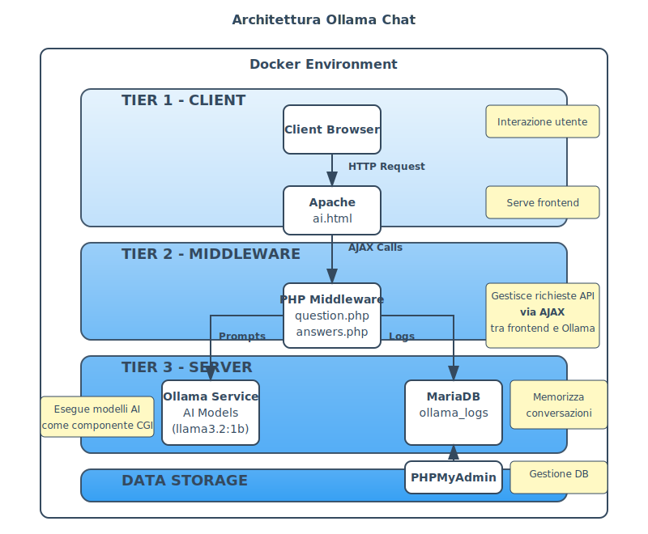

# Ollama Chat - Applicazione di Chat con AI Locale

## Indice

- [Panoramica](#panoramica)
- [Obiettivo del Progetto](#obiettivo-del-progetto)
- [Architettura](#architettura)
- [Requisiti](#requisiti)
- [Installazione](#installazione)
  - [1. Clona il repository](#1-clona-il-repository)
  - [2. Configura l'ambiente](#2-configura-lambiente)
  - [3. Avvia i servizi](#3-avvia-i-servizi)
  - [4. Installa il modello di linguaggio in Ollama](#4-installa-il-modello-di-linguaggio-in-ollama)
  - [5. Accedi all'applicazione](#5-accedi-allapplicazione)
- [Configurazione per la rete locale](#configurazione-per-la-rete-locale)
- [Utilizzo](#utilizzo)
- [Screenshot](#screenshot)
- [Personalizzazione](#personalizzazione)
- [Sicurezza](#sicurezza)
- [Risoluzione dei problemi](#risoluzione-dei-problemi)
- [Contribuire](#contribuire)
- [Licenza](#licenza)

## Panoramica

Ollama Chat è un'applicazione web che permette di interagire con modelli di linguaggio di Ollama in un'interfaccia di chat moderna e intuitiva. L'applicazione è costruita utilizzando un'architettura a 3 tier (client-middleware-server) basata su Docker, che include:

- **Frontend (Client)**: Interfaccia utente HTML/CSS/JavaScript servita da Apache
- **Middleware PHP**: API per gestire le richieste tra il frontend e Ollama, funzionando come intermediario di comunicazione
- **Ollama (Server)**: Servizio che esegue i modelli di linguaggio localmente, simile a un componente CGI
- **MariaDB**: Database per memorizzare le conversazioni
- **PHPMyAdmin**: Interfaccia web per gestire il database

## Obiettivo del Progetto

È importante sottolineare che questo progetto è stato sviluppato principalmente come esempio didattico e non come un'applicazione di chat AI completa e pronta per la produzione. Ollama Chat è stato creato con l'obiettivo di illustrare in modo concreto i concetti studiati nell'ambito delle architetture a 3 tier (client-middleware-server), dell'integrazione di modelli AI locali e dello sviluppo di applicazioni web moderne.

Questo progetto dimostra in particolare:

- L'implementazione di un'architettura a 3 tier ben definita, con separazione chiara tra presentazione (frontend), logica applicativa (middleware) e dati/elaborazione (backend)
- L'utilizzo di AJAX per comunicazioni asincrone tra frontend e middleware, permettendo un'esperienza utente fluida senza ricaricare la pagina
- L'utilizzo di Ollama come componente server simile a CGI (Common Gateway Interface), che elabora le richieste e genera risposte dinamiche
- L'integrazione di modelli di linguaggio locali in un'applicazione web containerizzata

Questo repository serve quindi come caso di studio pratico che dimostra l'implementazione di concetti teorici in un contesto reale, permettendo di visualizzare e comprendere meglio le tecnologie e le metodologie apprese durante il percorso di studio.

## Architettura



L'applicazione implementa un'architettura a 3 tier (client-middleware-server) organizzata nei seguenti componenti:

1. **Tier 1 - Client (Apache)**: Serve l'interfaccia utente HTML/CSS/JavaScript, gestendo la presentazione e l'interazione con l'utente
2. **Tier 2 - Middleware (PHP)**: Gestisce le richieste API, comunica con Ollama e salva le conversazioni nel database, fungendo da intermediario tra il client e il server
3. **Tier 3 - Server (Ollama)**: Esegue i modelli di linguaggio localmente, funzionando in modo simile a un componente CGI che elabora le richieste e genera risposte dinamiche
4. **MariaDB**: Memorizza le conversazioni degli utenti, fornendo persistenza dei dati
5. **PHPMyAdmin**: Fornisce un'interfaccia web per gestire il database

## Requisiti

- Docker e Docker Compose
- Almeno 8GB di RAM (consigliati 16GB per modelli più grandi)
- Spazio su disco sufficiente per i modelli di Ollama (almeno 5GB)

## Installazione

### 1. Clona il repository

```bash
git clone https://github.com/TheLi0ns/Ollama-chat.git
cd ollama-chat
```

### 2. Configura l'ambiente

Crea un file `.env` basato sul file `.env.example` fornito:

```bash
cp .env.example .env
```

Modifica il file `.env` con le tue impostazioni:

```
# Configurazione Database
DB_HOST=mariadb
DB_USER=root
DB_PASSWORD=secure_password_here
DB_NAME=ollama_logs
DB_ROOT_PASSWORD=secure_root_password_here

# Configurazione Porte
PHPMYADMIN_PORT=8090
MIDDLEWARE_PORT=8081

# Configurazione Ollama
OLLAMA_URL=http://ollama:11434/api/generate
```

Prima di avviare l'applicazione, è necessario creare un volume Docker per Ollama:

```bash
docker volume create ollama
```

### 3. Avvia i servizi

```bash
docker-compose up -d
```

Questo comando avvierà tutti i servizi definiti nel file `docker-compose.yml`.

### 4. Installa il modello di linguaggio in Ollama

Prima di utilizzare l'applicazione, è necessario installare almeno un modello di linguaggio nel container Ollama. Per farlo, esegui i seguenti comandi:

```bash
# Accedi al container Ollama
docker exec -it ollama-chat-ollama-1 bash

# Installa il modello desiderato (esempi)
ollama pull llama3.2:1b    # Modello piccolo (1.5GB)
ollama pull llama3.2:8b    # Modello medio (8GB)
ollama pull llama3.2:70b   # Modello grande (70GB)
ollama pull mistral:7b     # Alternativa: Mistral 7B
ollama pull gemma:7b       # Alternativa: Gemma 7B
```

Puoi verificare i modelli installati con:

```bash
ollama list
```

Nota: Il download e l'installazione del modello potrebbero richiedere tempo a seconda della velocità della connessione internet e delle dimensioni del modello scelto.

### 5. Accedi all'applicazione

Apri il browser e vai a:
- **Chat UI**: http://localhost
- **PHPMyAdmin**: http://localhost:8090 (username: root, password: quella impostata nel file .env)

## Configurazione per la rete locale

Per utilizzare l'applicazione in una rete locale, è necessario modificare alcuni file di configurazione:

### 1. Modifica il file `apache/ai.html`

Cerca tutte le occorrenze di `localhost` e sostituiscile con l'indirizzo IP del tuo computer nella rete locale. Ad esempio:

```javascript
// Da
fetch('http://localhost:8081/question.php', {

// A
fetch('http://192.168.1.100:8081/question.php', {
```

Modifica anche le impostazioni CORS nel file `middlewarePHP/question.php` e `middlewarePHP/answers.php`:

```php
// Da
header("Access-Control-Allow-Origin: http://localhost");

// A
header("Access-Control-Allow-Origin: http://192.168.1.100");
```

### 2. Riavvia i servizi

Dopo aver apportato le modifiche, riavvia i servizi:

```bash
docker-compose down
docker-compose up -d
```

## Utilizzo

1. Apri l'interfaccia web all'indirizzo http://localhost (o l'IP della tua macchina nella rete locale)
2. Digita una domanda nel campo di input e premi "Invia" o premi Enter
3. Attendi la risposta dal modello di linguaggio
4. Le conversazioni vengono salvate automaticamente e possono essere ricaricate all'avvio dell'applicazione

## Screenshot

### Versione Desktop


### Versione Mobile


## Personalizzazione

### Cambiare il modello di linguaggio

Per utilizzare un modello diverso, assicurati prima di averlo installato nel container Ollama (vedi sezione "Installa il modello di linguaggio in Ollama"), poi modifica il file `middlewarePHP/question.php`:

```php
$data = [
    'prompt' => $chiedi,
    'model' => "llama3.2:1b", // Cambia con il nome del modello desiderato
    'stream' => false
];
```

Utilizza lo stesso nome del modello che hai installato con il comando `ollama pull`.

### Personalizzare l'interfaccia

Puoi modificare l'aspetto dell'interfaccia utente modificando il file `apache/ai.html`.

## Sicurezza

### Best Practices

1. **Cambia le password predefinite**: Modifica sempre le password predefinite nel file `.env`
2. **Limita l'accesso**: Configura correttamente i firewall per limitare l'accesso ai servizi
3. **HTTPS**: In produzione, configura sempre HTTPS per proteggere le comunicazioni
4. **CORS**: Configura correttamente le impostazioni CORS nei file PHP per limitare le origini consentite

## Risoluzione dei problemi

### Il servizio Ollama non si avvia

Assicurati di aver creato il volume Docker per Ollama:

```bash
docker volume create ollama
```

### Problemi di connessione al database

Verifica che il servizio MariaDB sia in esecuzione:

```bash
docker-compose ps
```

### L'interfaccia web non si connette al middleware

Verifica che le variabili d'ambiente siano configurate correttamente nel file `.env`.

## Contribuire

Se desideri contribuire al progetto, sentiti libero di aprire una pull request o segnalare problemi nella sezione Issues di GitHub.

## Licenza

Questo progetto è distribuito con licenza Creative Commons Attribution 4.0 International (CC BY 4.0). Vedi il file [LICENSE](LICENSE) per maggiori dettagli.